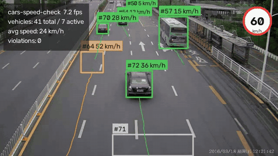

# cars_speed_check

[](https://github.com/ALSRKAL/cars_speed_check/actions/workflows/ci.yml)
[](LICENSE)
[](pyproject.toml)
[](https://docs.astral.sh/ruff/)

**Vehicle speed estimation from ordinary video** — YOLO detection, ByteTrack
persistent IDs and a perspective-aware pixels-per-metre model, with a speed
limit sign, trajectory trails, a live HUD and a per-vehicle CSV report.



> v2.0 is a complete rewrite of the original single-file experiment
> ([the old `speed_check.py`](https://github.com/ALSRKAL/cars_speed_check/blob/6b1f310add0f87d3d9f4a739568f6565aee5aeba/speed_check.py))
> — Haarcascade + dlib are gone, replaced by a typed, tested, installable
> package. See [CHANGELOG.md](CHANGELOG.md).

---

## How it works

| Stage | What happens |
|---|---|
| **Detect** | `ultralytics` YOLO (yolov8n by default) finds road vehicles — cars, motorcycles, buses, trucks — every frame |
| **Track** | ByteTrack keeps a persistent ID per vehicle, surviving occlusions and missed frames |
| **Calibrate** | Two horizontal reference lines map image rows to pixels-per-metre (ppm); ppm is interpolated linearly between them, because a metre near the camera projects to far more pixels than a metre near the horizon |
| **Estimate speed** | Displacement over a sliding window (≈0.6 s) ÷ ppm at the travelled midpoint ÷ elapsed time, median-filtered and EMA-smoothed; glitch estimates above a plausibility cap are discarded |
| **Report** | Colour-coded labels (green / amber / red vs. the speed limit), trails, HUD, per-vehicle CSV |

The bundled sample `cars.mp4` (640×360 @ 25 fps) ships calibrated: ppm was
measured from clearly visible cars (≈4.6 m long) at two depths —
`6.0 px/m` at row y=100 and `19.0 px/m` at row y=300.

## Install

```bash
git clone https://github.com/ALSRKAL/cars_speed_check.git
cd cars_speed_check
python -m venv .venv && source .venv/bin/activate
pip install -r requirements.txt
```

> Linux + pip pulls the CUDA build of PyTorch by default (~2 GB extra).
> CPU-only machines can slim that down:
> ```bash
> pip install torch torchvision --index-url https://download.pytorch.org/whl/cpu
> pip install -r requirements.txt
> ```

The YOLO weights (`yolov8n.pt`, ~6 MB) download automatically on first run.

## Quick start

```bash
# the bundled sample, fully annotated, with a 60 km/h limit and CSV report
carspeed run cars.mp4 \
    --ppm-far 6.0@100 --ppm-near 19.0@300 \
    --limit 60 --output output.mp4 --csv vehicles.csv

# any other video — calibrate first (see below), then point at your file
carspeed run /path/to/traffic.mp4 --ppm-far 5.2@110 --ppm-near 17@280 --limit 50

# a webcam (index 0), imperial units
carspeed run 0 --ppm-far 6@100 --ppm-near 19@300 --units mph

# headless (servers / CI): no preview window
carspeed run cars.mp4 --ppm-far 6@100 --ppm-near 19@300 --no-display
```

In the preview window: `s` saves a snapshot PNG, `q`/`ESC` quits.

When the run ends you get a per-vehicle table in the terminal:

```
  ID class       dir    first   last   mean    max over
----  ----------  ----  ------  ------  -----  ----- -----
   2  car         ->       0.0     5.1   22.2   44.9
  11  car         ->       0.6     6.3   21.6   55.2
  33  car         R->L     5.6     7.0   48.4   56.9
  45  car         ->       7.5    13.1   23.6   54.3
...
63 vehicles measured, 0 over limit (limit: 60 km/h)
```

(the real output for the bundled sample — also written to
[`assets/vehicles.csv`](assets/vehicles.csv))

## Calibrating a new video

Speed accuracy depends entirely on the pixels-per-metre model, and ppm
changes with depth in the frame. For a new camera/video:

```bash
carspeed calibrate your_video.mp4
```

A window opens with instructions:

1. **Click two points spanning a distance you know along the road** — the
   length of a clearly visible car (~4.5 m), a bus (~11 m), or a dash+gap
   period of the lane line — near the **top** of the road, then type the
   real distance in metres in the terminal.
2. Repeat near the **bottom** of the road.
3. The tool prints the ready-to-use
   `--ppm-far PPM@Y --ppm-near PPM@Y` arguments.

The two lines are stored as a linear ppm(y) model — clamped towards the
horizon, gently extrapolated below the near line. Verify plausibility with
`--show-calibration` and compare against a vehicle you can clock by eye.

## CLI reference

| Command / flag | Meaning |
|---|---|
| `carspeed run SOURCE` | process a video file or webcam index |
| `--ppm-far PPM@Y` / `--ppm-near PPM@Y` | the two calibration lines (required) |
| `-o, --output PATH` | save the annotated MP4 |
| `--csv PATH` | per-vehicle CSV report |
| `--limit N` | speed limit → colour coding + violations + sign overlay |
| `--units kmh\|mph` | display units |
| `--model`, `--tracker`, `--conf`, `--iou`, `--imgsz` | detection/tracking tuning |
| `--classes car,motorcycle,bus,truck` | which vehicles to track |
| `--window S` | speed estimation window in seconds |
| `--resize W`, `--max-frames N` | performance knobs |
| `--no-display`, `--no-trails`, `--show-calibration` | rendering options |
| `carspeed calibrate SOURCE` | interactive calibration helper |
| `carspeed info SOURCE` | print resolution / fps / duration |

## Architecture

```
speedcheck/
├── config.py     typed dataclass configs + the two-line ppm model
├── speed.py      sliding-window estimator (median filter + EMA)
├── tracker.py    per-vehicle state on top of ByteTrack IDs, TrackManager
├── annotate.py   boxes, labels, trails, HUD, speed-limit sign
├── report.py     per-vehicle summaries, CSV export, terminal table
├── pipeline.py   detection → tracking → speeds → rendering loop
├── calibrate.py  interactive two-line calibration wizard
└── cli.py        carspeed run | calibrate | info
```

## Development

```bash
pip install -r requirements-dev.txt
ruff check speedcheck tests     # lint
pytest                          # unit tests (no network, no model)
```

## Notes & limits

- Speeds are **estimates**: accuracy is bounded by the calibration and by
  lens distortion; expect a few km/h of error even with careful calibration.
- The model assumes a roughly flat road and a fixed camera; for moving
  cameras or hills you would need a proper homography.
- `vehicles.csv` from the bundled sample is committed under
  [`assets/`](assets/) as a reference output.

## License

[MIT](LICENSE) © ALSRKAL

## نظرة سريعة بالعربية

مشروع **cars_speed_check** لتقدير سرعة المركبات من الفيديو: كشف بـ **YOLO**،
تتبع مستمر بمعرّفات ثابتة عبر **ByteTrack**، وحساب السرعة بنموذج معايرة
منظوري من سطرين (بكسل/متر بعيد + بكسل/متر قريب) مع تنعيم إحصائي لمنع القفزات.

```bash
pip install -r requirements.txt
carspeed run cars.mp4 --ppm-far 6@100 --ppm-near 19@300 --limit 60 \
    --output output.mp4 --csv vehicles.csv
```

ولمعايرة فيديو جديد تفاعلياً: `carspeed calibrate فيديوك.mp4` — انقر مسافة
معروفة قرب أعلى الطريق ثم قرب أسفله، وستحصل على معاملات التشغيل جاهزة.
الإصدار 2.0 إعادة كتابة كاملة للنسخة القديمة (Haarcascade + dlib) كحزمة
مهيكلة مُختبَرة بالكامل — التفاصيل في [CHANGELOG.md](CHANGELOG.md).
